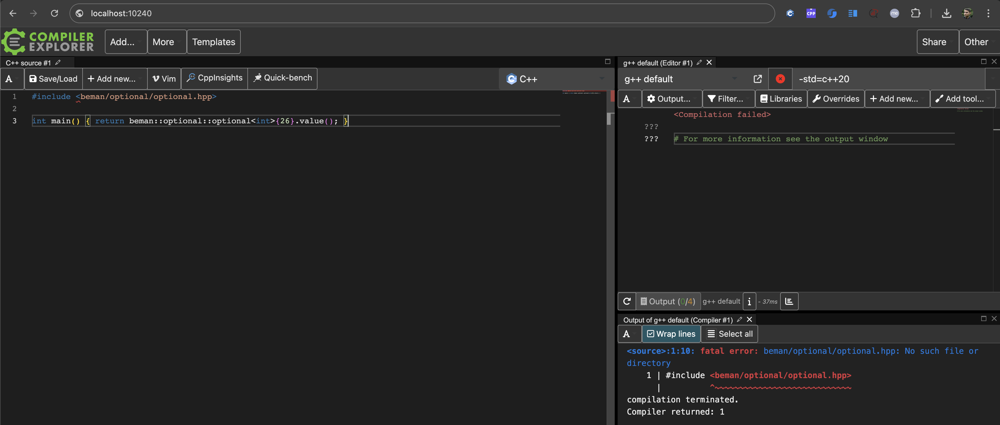
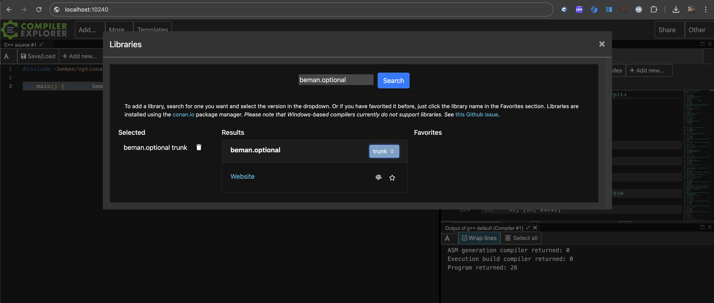

<!--
SPDX-License-Identifier: Apache-2.0 WITH LLVM-exception
-->

# Tutorial: Compiler Explorer Deployment

Full instructins are available at [compiler-explorer: Adding a new library](https://github.com/compiler-explorer/compiler-explorer/blob/main/docs/AddingALibrary.md). This page is a Beman cheatsheet.

## Integrating a header-only library

### Step by step example: `beman.optional`

#### 1. Clone Compiler Explorer repos

```bash
$ git clone https://github.com/compiler-explorer/infra
$ git clone https://github.com/compiler-explorer/compiler-explorer
```

#### 2. Update `infra`

   2.1. Locate an existing Beman library inside `bin/yaml/libraries.yaml` - e.g. search for `repo: bemanproject/optional`.

   2.2. Add a new entry (keeping Beman entries grouped and sorted):

```yml
beman_optional:
  build_type: none
  check_file: README.md
  method: nightlyclone
  repo: bemanproject/optional
  targets:
  - main
  type: github
```

Notes:

* `build_type: none`: Not required to run a build command (header-only libraries).
* `check_file: README.md`: The platform checks the hash of this file.
* `method: nightlyclone`: Do a deployment every day. We don't want and don't need more often deployment.
* `repo: bemanproject/optional`: Clone and deploy `beman.optional` from <https://github.com/bemanproject/optional>.
* `target: ... main`: Only deploy main as trunk version.
* `type: github`: The repo will be always clone with latest version.

  2.3. Deploy local `infra/` instance. For header-only libraries, it's enough to just run:

```bash
# Create default deployment directory and make sure to set write permissions for your user.
$ mkdir -p /opt/compiler-explorer
$ ls -l /opt/                  
drwxr-xr-x  25 dariusn  wheel   800 Apr  7 21:29 compiler-explorer

$ cd infra/
$ make ce
$ bin/ce_install --enable nightly install beman_optional
...
 2025-04-07 23:05:07,137 lib.ce_install  INFO     libraries/c++/nightly/beman_optional main installed OK
1 packages installed OK, 0 skipped, and 0 failed installation
```

Notes: Tested on `MacOS 14.6` (aarch64) and `Ubuntu 24.04` (aarch64).

  2.4. On success, you can find the new Beman library deployed on local setup in `/opt/compiler-explorer`. E.g., for `beman.optional` installation should see this tree:

```bash
$ tree --charset=ascii /opt/compiler-explorer/libs/beman_optional
/opt/compiler-explorer/libs/beman_optional
`-- main
    |-- ...
    |-- examples
    |   |-- CMakeLists.txt
    |   |-- README.md
    |   |-- concept_checks.cpp
    |   |-- optional_ref.cpp
    |   |-- pythagorean_triples.cpp
    |   |-- range_loop.cpp
    |   |-- sample.cpp
    |   `-- std_vs_beman.cpp
    |-- include
    |   `-- beman
    |       `-- optional
    |           |-- CMakeLists.txt
    |           |-- detail
    |           |   |-- iterator.hpp
    |           |   `-- stl_interfaces
    |           |       |-- config.hpp
    |           |       |-- fwd.hpp
    |           |       `-- iterator_interface.hpp
    |           `-- optional.hpp
    |-- papers
    |   `-- ...
    `-- tests
        `-- beman
            `-- optional
                |-- ...
                |-- optional.t.cpp
                ...
```

Note: Currently, we copy the entire tree (including build files, docs, tests etc). In [#111: Skip unnecessary files in Compiler Explorer deployments](https://github.com/bemanproject/beman/issues/111) will ensure that only required files are copied.

  2.5. Commit `bin/yaml/libraries.yaml` and push the changes upstream! (PR instructions at step 4)

#### 3. Update `compiler-explorer`

  3.1. Locate or create `etc/config/c++.local.properties`. Add your entry according to Compiler Explorer docs (examples also in `etc/config/c++.amazon.properties`). For example, for adding `beman.optional` from step 2, do this:

```yml
# Installed libs (see c++.amazon.properties for production examples)
libs=beman_optional                                                                            # The list of libraries separated by colons, e.g. beman_optional

libs.beman_optional.name=beman.optional                                                         # The name of the library.
libs.beman_optional.versions=trunk                                                              # The version of the library, always trunk for now.  
libs.beman_optional.url=https://github.com/bemanproject/optional                                # The URL of the library.
libs.beman_optional.versions.trunk.version=trunk                                                # The version of the library, always trunk for now.
libs.beman_optional.versions.trunk.path=/opt/compiler-explorer/libs/beman_optional/main/include # The path to the library.
```

  3.2. Start local deployment:

```bash
$ cd compiler-explorer/
$ make
...
info:   Listening on http://localhost:10240/
...
```

  3.3. Go to <http://localhost:10240/> and try to compile a code which includes your library, e.g.:

```cpp
#include <beman/optional/optional.hpp>

int main() { return beman::optional::optional<int>{26}.value(); }
```



  3.4. Go to `Include libs`:


  3.5. Search for your library - e.g. `beman.optional` - and selected deployed version - e.g. `trunk`:



  3.6. Your local deployment is working!


  3.7. Mirror changes from `etc/config/c++.local.properties` to `etc/config/c++.amazon.properties` (need to find the place to insert the new Beman library alongside the existing ones).

```bash
$ cat etc/config/c++.amazon.properties | grep -A3 -B3 beman_optional
/c++.amazon.properties
#################################
#################################
# Installed libs
libs=abseil:array:async_simple:belleviews:beman_iterator_interface:beman_optional:benchmark:...
...
libs.beman_iterator_interface.versions.trunk.lookupversion=main

libs.beman_optional.name=beman.optional
libs.beman_optional.versions=trunk
libs.beman_optional.url=https://github.com/beman-project/optional
libs.beman_optional.versions.trunk.version=trunk
libs.beman_optional.versions.trunk.path=/opt/compiler-explorer/libs/beman_optional/main/include

libs.benchmark.name=Google Benchmark
...
```

  3.8. Commit `etc/config/c++.amazon.properties`. Commit and push the changes upstream! (PR instructions at step 4)

#### 4. Open PRs
   4.1. Open issues in Compiler Explorer repo. Example: <https://github.com/compiler-explorer/compiler-explorer/issues/6651>.

   4.2.: Open PR with change from `bin/yaml/libraries.yaml` in <https://github.com/compiler-explorer/infra>. Commit example: <https://github.com/compiler-explorer/infra/commit/96d504ac2d39212d22fc3dc5f8c7be3909457d29>.

   4.3.: Open PR with change from `etc/config/c++.amazon.properties` in <https://github.com/compiler-explorer/compiler-explorer>. Commit example: <https://github.com/compiler-explorer/compiler-explorer/commit/738fd3b0c5979677e56d3550526efe2eaaa6f2fe>.

   4.4. Link both PRs to your CE issue and to your Beman issue.

   4.5. Ping CE owners for review (first landed PR should be done in the infra repo).

### Header-only library, but a processing step is required - example: `beman.iterator_interface`

Instructions are similar to previous section, but a build command neededs to be run to properly generate final deployable header.

For example, to deploy / install `beman.iterator_interface` on Compiler Explorer, we follow the previous steps:

#### 1. Clone Compiler Explorer repos

Same as in [Integrating a header-only library](#integrating-a-header-only-library).

#### 2. Updates in `infra`


Update `infra/bin/yaml/libraries.yaml`:

```yaml
...
beman_iterator_interface:
  after_stage_script:
  - sed -i 's/add_subdirectory(examples)//g' CMakeLists.txt
  build_type: cmake
  check_file: README.md
  extra_cmake_arg:
  - -DBUILD_TESTING=OFF
  lib_type: static
  package_install: true
  method: nightlyclone
  repo: bemanproject/iterator_interface
  staticliblink:
  - beman.iterator_interface
  targets:
  - main
  type: github
...
beman_optional:
  build_type: none
```

Notes:

* `build_type: cmake`: Run a cmake command.
* `extra_cmake_arg:`: Pass arguments to cmake, e.g. disable building tests (`-DBUILD_TESTING=OFF`).
* `lib_type: static`: Generate a static library.
* `package_install: true`: Install build artifacts.

#### 3. Update `compiler-explorer`


Update: `compiler-explorer/etc/config/c++.amazon.properties`:

```yaml
...
libs=...:beman_iterator_interface:beman_optional:...
...
libs.beman_iterator_interface.name=beman.iterator_interface
libs.beman_iterator_interface.versions=trunk
libs.beman_iterator_interface.url=https://github.com/bemanproject/iterator_interface
libs.beman_iterator_interface.packagedheaders=true
libs.beman_iterator_interface.staticliblink=beman.iterator_interface
libs.beman_iterator_interface.versions.trunk.version=trunk
libs.beman_iterator_interface.versions.trunk.lookupversion=main
...
```

* Same testing instructions as in [Integrating a header-only library](#integrating-a-header-only-library)

#### 4. Open PRs

Same as in [Integrating a header-only library](#integrating-a-header-only-library).

## Non header-only library

Currently, there are no such usages inside The Beman Project. 
